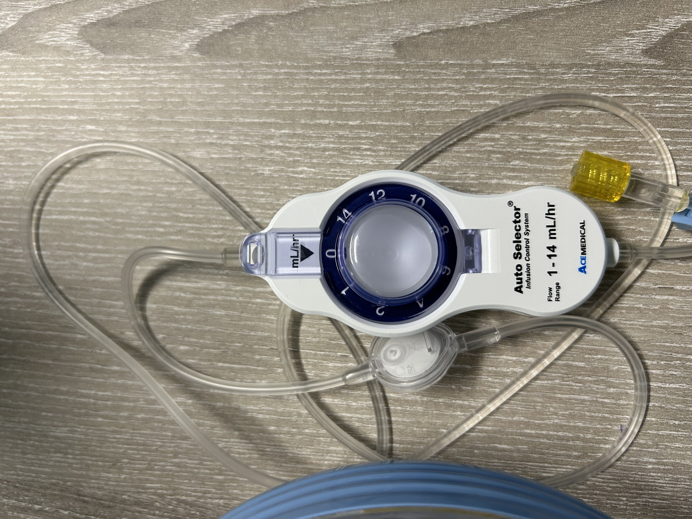
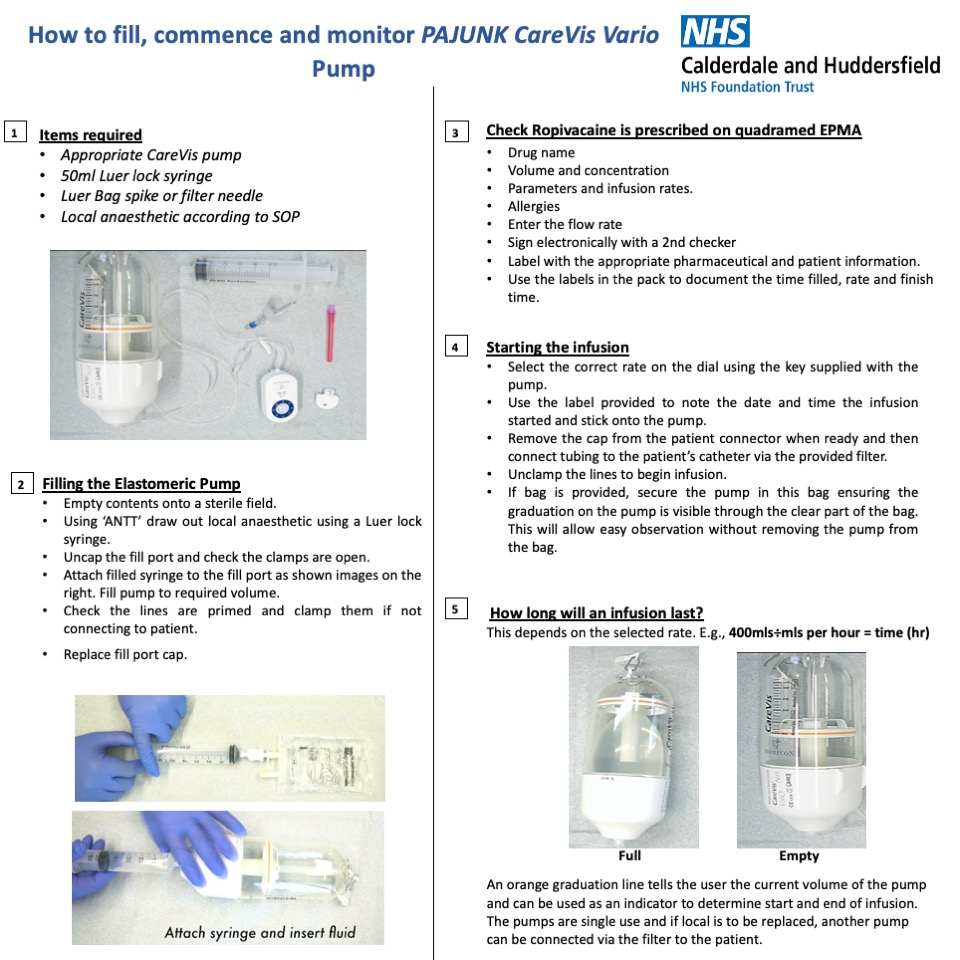

Dear Colleagues,

We are writing to inform you of a critical issue regarding the AutoFuser elastomeric pumps currently in use within our Trust. Recent observations and reports have highlighted significant discrepancies in the delivery rates of these pumps, necessitating immediate attention and action.

{width=40%}

{width=40%}

Website: https://ace-medical.com/?page_id=2075

**Summary of Issues:**

1. **Inaccurate Delivery Rates**: Instances have been reported where the pumps deliver medication at rates double what has been set, with observed maximum rates reaching 20 mls/hour when set to 10 mls/hour. We have had seven cases of this currently.

2. **Inconsistencies Across Locations**: Colleagues at Grimsby have reported similar problems, albeit with the pumps delivering at reduced rates compared to those set.

3. **Setup and Sterility Concerns**: Although the AutoFuser's concave fill port is designed to minimise sterility issues, the setup process remains labour-intensive and prone to complications.

**Safety Considerations:**
- Even at increased delivery rates, it is very unlikely that a toxic dose will be delivered. However, for patients weighing less than 50 kg, please consider alternative methods to ensure safety.

- **Example Calculation**: If a patient has a bilateral block and is unfortunately using two faulty pumps delivering at double the rate, this would result in 40 mls/hour for bilateral block. Using ropivacaine at 2 mg/ml, this amounts to 80 mg per hour. The toxic dose of ropivacaine is 3 mg/kg over a 2-hour period. Thus, 80 mg / 1.5 mg/kg indicates a minimum weight of 50 kg to avoid toxicity.

**Immediate Actions Required:**

1. **Alternative Methods of Analgesia**:

   - **Epidural Pumps**: 
   
   Where appropriate, especially for patients with rib fractures, consider the use of epidural pumps. These should be used on Major Trauma or surgical wards where feasible.
   
   - **Bolus Dosing**: 
   
   This method, while staff-intensive, allows for precise control over dosing and should be considered where no alternative can be found, for example an elderly 45 kg patient going to a medical ward: let the Pain Team know and we can arrange surtiable bolus dosing.
   
2. **Enhanced Monitoring**:

   - **Pain Team Involvement**:
   
   Ensure the Pain Team is informed of and involved in monitoring all elastomeric pumps currently in use.
   
   - **Regular Checks**: 
   Ensure nursing staff are alert to the issue and perform regular checks to verify that the pumps are delivering medication at the correct rate.

3. **Reporting and Documentation**:

   - **DATIX Reporting**: We have DATIX-ed it at the highest level. Datix  W309432. Continue to document all incidents and discrepancies through DATIX to maintain a comprehensive record of issues, we need these as they give weight to acquiring a sustainable solution.

**Efforts to Resolve the Issue:**

Please be assured that we are working hard to resolve this issue, including placing a temporary order for alternative pumps. However, these devices are niche and subject to market fluctuations in production and cost, which complicates the procurement process. This underlines our commitment to seeking a sustainable and environmentally friendly solution.

In the shortterm, we are looking at: CareVis Vario Infusion pump by Pajunk, see Appendix 1, if interested. Though we would see this as a temporary solution for cost and environmental reasons.

**IF IN DOUBT PLEASE DON'T USE**

**Long-Term Plan:**

In light of these ongoing issues, we are accelerating the implementation of the Inspiration Health combined system, which has been trialled with positive feedback. This system promises several benefits:

   - **Cost Reduction**:
   Expected to reduce overall costs to approximately one-third of current expenditure.
   - **Environmental Benefits**:
   The use of a single giving set will significantly reduce landfill waste.
   - **Ease of Use**: 
   Simplifies the process for ward staff to change bags, reducing setup time and effort.
   - **Advanced Features**:
   Includes hard-wired pain score features and a cloud facility for enhanced monitoring and data management.

Inspiration Health website: https://inspirationhealthcaregroup.com/product/micrel-rythmic-evolution-yellow-2/

**Conclusion:**

We acknowledge the challenges posed by the current situation and appreciate your patience and cooperation. The safety of our patients is our utmost priority, and we are working tirelessly to resolve these issues. In the interim, please adhere to the outlined actions to ensure patient safety and effective pain management.

If you have any questions or require further information, please do not hesitate to contact the Pain Team.

Yours sincerely,

Lydia Ashton  
Alan Race  
Pain Team  

Please ensure this alert is disseminated promptly to all relevant staff.

## Appendix 1

